# ii-practica3-fisicas

## Ejercicio 1
Velocidad que se adapta al tiempo que se presiona una de las teclas de movimiento.

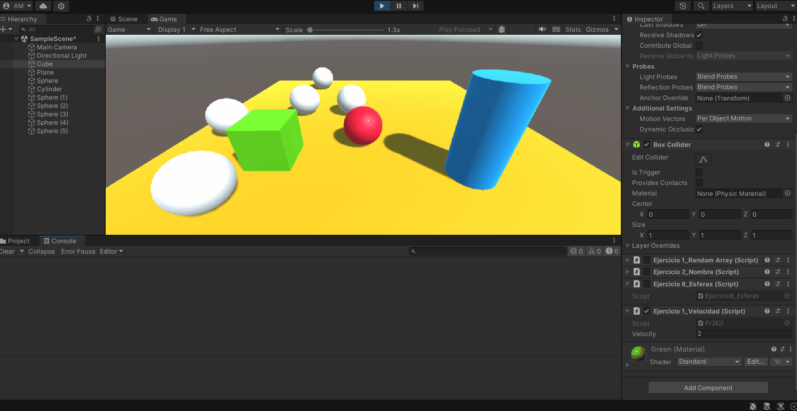

## Ejercicio 2
Mapeamos la tecla *H* a la función de disparo en el Input Manager.

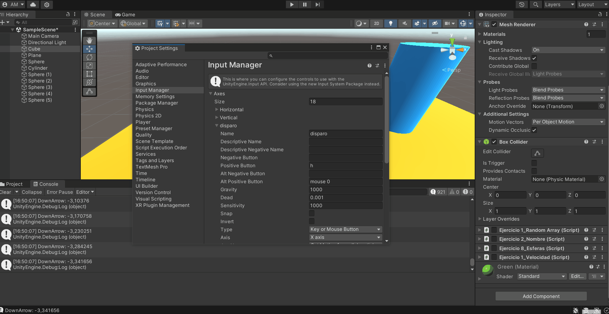

## Ejercicio 3
Movemos el cubo con `Translate()`.

### Apartado a)
Al duplicar las coordenadas del movimiento, el cubo se mueve a 2 unidades por segundo.

### Apartado b)
Al duplicar la velocidad del movimiento, el cubo se mueve a 2 unidades por segundo.

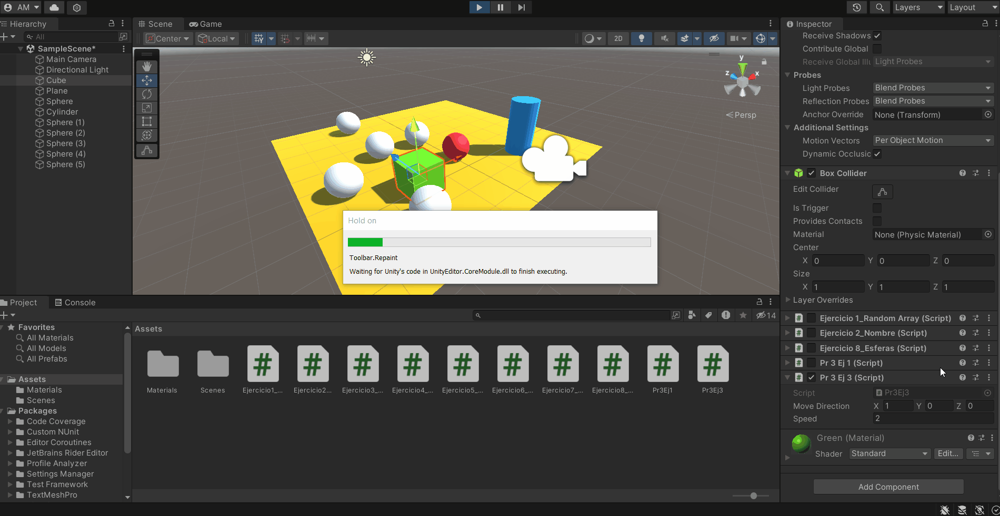

### Apartado c)
Al usar una velocidad <1, se desplaza más lento (a menos de una unidad/s).

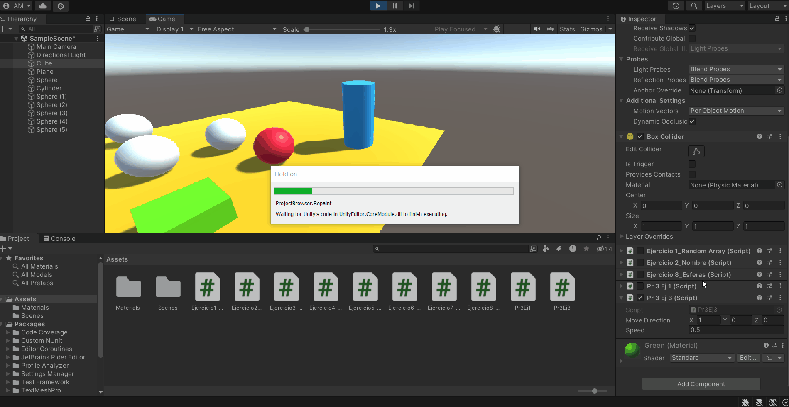

### Apartado d)
Al aumentar `y`, el cubo se posiciona más arriba en el eje vertical.

### Apartado e)
Al usar los ejes globales, el movimiento se independiza de la rotación que tenga el objeto.

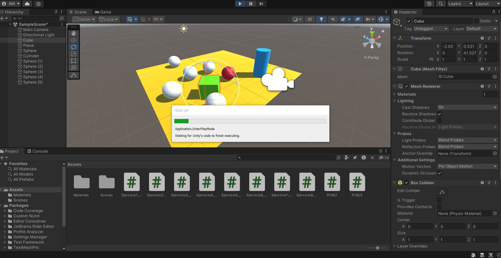

## Ejercicio 4
Movemos el cubo usando las flechas y la esfera con WASD.

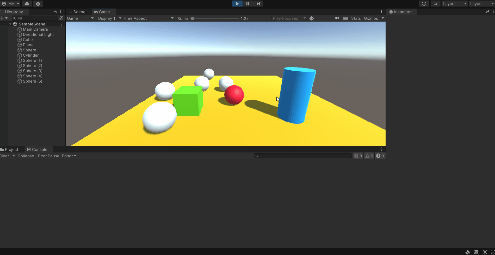

## Ejercicio 5
Suavizamos el movimiento de los objetos del ejercicio anterior con el tiempo entre *frames*.

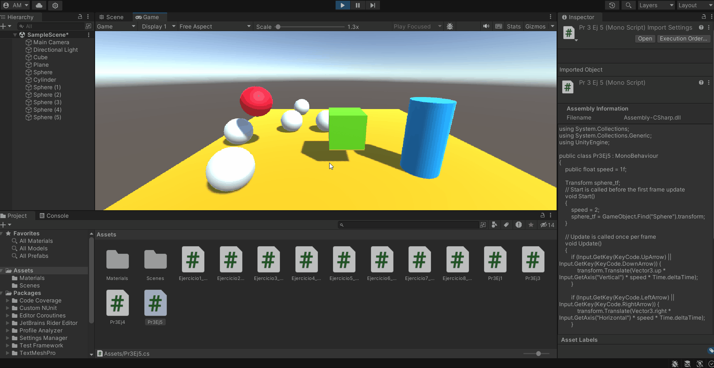

## Ejercicio 6
Hacemos que el el vector de movimiento del cubo sea el vector entre el cubo y la esfera.

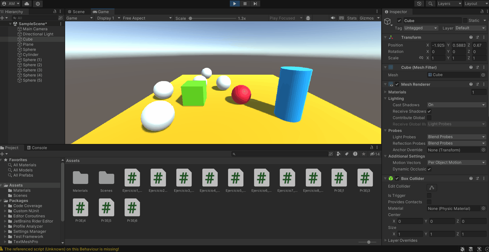

## Ejercicio 7
El cubo gira hacia la esfera en todo momento con `LookAt()`.

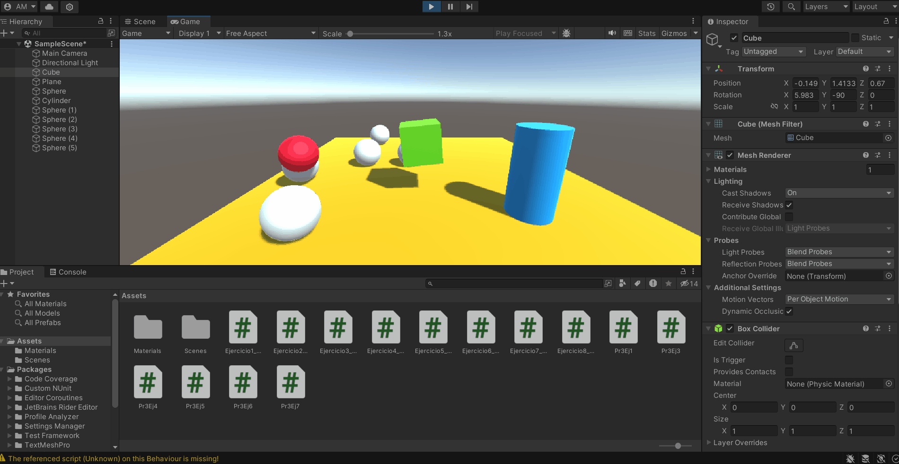

## Ejercicio 8
Ahora el cubo se mueve constantemente hacia la esfera y el movimiento es en el plano horizontal.

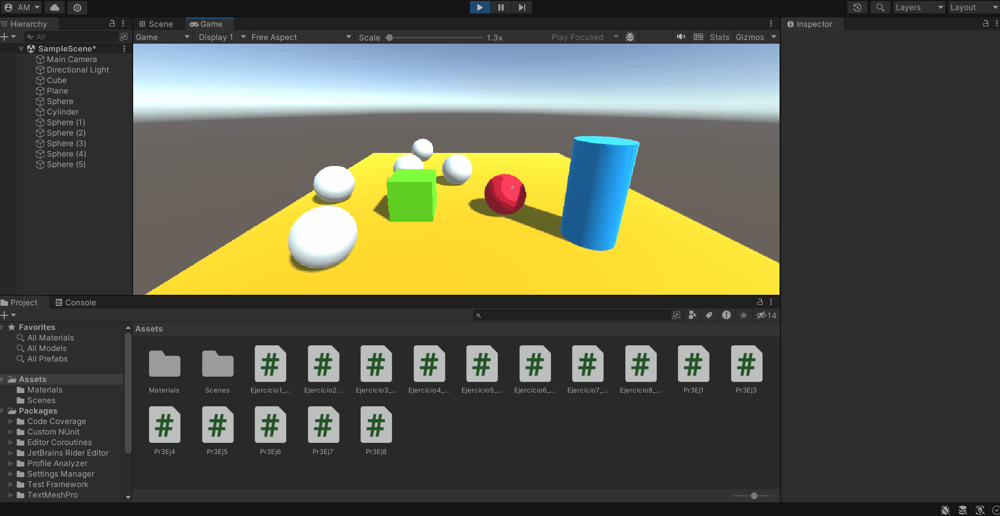

## Ejercicio 9
Hacemos el cilindro un *Rigidbody* y la esfera un *Rigidbody* cinemático.
Con un script en el cilindro mostramos el nombre de los objetos con los que colisiona.

## Ejercicio 10
Ahora la esfera no es cinemática, por lo que es afectada por la gravedad y el cubo es cinemático.
Los scripts se mantienen igual, ya que se logra el mismo efecto.

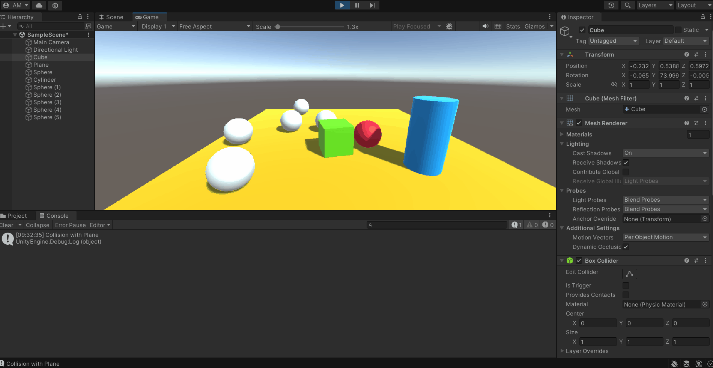

## Ejercicio 11
El cilindro es un *objeto trigger* y lo hemos hecho cinemático para que no caiga al vacío.
También se ha modificado el script del ejercicio 9 para que se active `OnTriggerEnter()`.

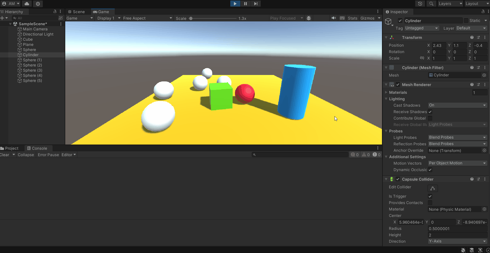

## Ejercicio 12
Creamos un segundo cilindro naranja que se mueve con IJKL (análogo a WASD). La tecla **H** se usa para atraer el cilindro hacia la esfera.
- Si la esfera tiene más masa, costará moverla con el cilindro, mientras que si es baja se moverá casi sin esfuerzo.
- Si marcamos como cinemática la esfera, no será afectada por la física.
- Si marcamos como trigger la esfera (pero no cinemática), será solo afectada por la gravedad, por lo que se caerá nada más iniciar la escena.
- Con la fricción alta, el cilindro se para en seco con cada movimiento, mientras que si la fricción es 0, se resbala.

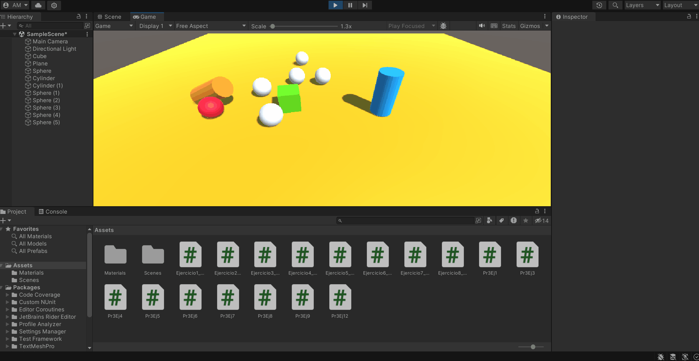

